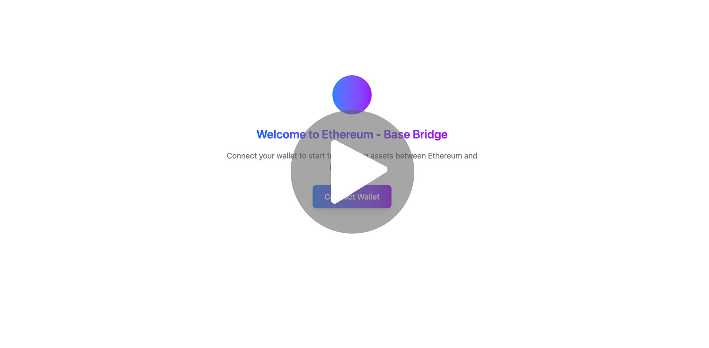

# 🌉 Bridge EVM
A simple yet powerful token bridge between Ethereum Sepolia and Base Sepolia test networks.

This project demonstrates how assets can move across chains using lock / mint / burn / unlock mechanics — powered by a backend, relayer, and frontend working together.

## Tokens
ASLC - ERC20 token deployed on Ethereum Sepolia \
BASLC - ERC20 token deployed on Base Sepolia

## Features
- 🔒 **Lock** ASLC tokens on Ethereum Sepolia
- 🪄 **Mint** BASLC tokens on Base Sepolia (1:1 to locked ASLC)
- 🔥 **Burn** BASLC tokens on Base Sepolia
- 🔓 **Unlock** ASLC tokens back on Ethereum Sepolia
- ⚡ Supports batching: lock/burn multiple times and mint/unlock in one go

## Project Demo
[](https://youtu.be/uISql3_T8eU)

**Deployed Contracts**
- [Ethereum Sepolia Bridge Contract](https://sepolia.etherscan.io/address/0x6a0ff80d8e06fce94aa700d0a8b89956b1fdc4ac)
- [Base Sepolia Bridge Contract](https://sepolia.basescan.org/address/0xff455879ca5e14dac4cf42f06ded2381e8f419e7)
- [ASLC ERC20 Token - Token on Ethereum Chain](https://sepolia.etherscan.io/address/0xdbfd18549Cf11Db3Bd813717AaeB04132485ff2C)
- [BASLC ERC20 Token - Bridged Token on Base Chain](https://sepolia.basescan.org/address/0xE2C3Ed6dAf75E1d6Aa6B28d88F2F6949C8E28a95)

## 🚀 Running Locally

> ⚠️ **Note**: For security reasons, you’ll deploy your **own contracts** instead of using mine.  
> This ensures you control the private key that signs bridge transactions.  

### 1. Deploy Contracts  
Contracts are built with [Foundry](https://getfoundry.sh/).  
If you don’t already have it, [install Foundry](https://getfoundry.sh/introduction/installation).  

1. Setup environment:  

   ```
   cd contracts
   cp .env.example .env
   ```
   Get RPC URLs from Alchemy, Infura, or another provider.
   Get API keys from [Etherscan](https://etherscan.io/myaccount) and [Basescan](https://basescan.org/myaccount).
2. Deploy bridge contracts: \
   Run `source .env` first in the terminal to load the envs.
   1. Ethereum Sepolia. 
      
      ```
      forge script --chain sepolia script/BridgeETH.s.sol:BridgeETHScript --rpc-url $SEPOLIA_RPC_URL --broadcast --verify -vvvv --private-key <YOUR_PRIVATE_KEY>
      ```
   2. Base Sepolia.
       
      ```
      forge script script/BridgeBase.s.sol:BridgeBaseScript --rpc-url $BASE_SEPOLIA_RPC_URL --broadcast --verify -vvvv --private-key <YOUR_PRIVATE_KEY>
      ```
   Record the deployed contract addresses — you’ll need them later.

### 2. Run with Docker (Recommended 🐳)
1. Copy the root env file and fill in values. Keep the DATABASE_URL as it is.

   ```
   cp .env.example .env
   ```
2. Create `private-key.txt` at the root and paste the private key you used for deployment.
   > This is required so the relayer can listen to bridge events and sign unlock/mint transactions.
3. Start everything:

   ```
   docker-compose up --build
   ```
4. Open the app at [http://localhost:3000](http://localhost:3000) 🎉

### 3. Run without Docker (Manual Mode 🛠️)
1. Start a Postgres instance (Docker or local).
2. Create .env files for backend, relayer, and frontend from their respective .env.example.
3. Deploy contracts as described above.
4. Run backend:
   ```
   cd backend
   npm run start
   ```
5. Run relayer:
   ```
   cd relayer
   npx prisma migrate deploy
   npm run start
   ```
6. Run the frontend:
   ```
   cd frontend
   npm run dev
   ```

## 🛠️ Tech Stack
- Smart Contracts: Solidity, Foundry
- Backend: Express + Prisma + PostgreSQL
- Relayer: Node.js (polling chain events every 5s)
- Frontend: React + Vite + TypeScript
- Infra: Docker Compose

## 🤝 Contributing
Want to make this bridge cooler? PRs and issues are welcome! \
This is a learning/demo project, so experiments and improvements are encouraged 🚀.

---
🔥 That’s it! Now go bridge some tokens across testnets like a pro.
